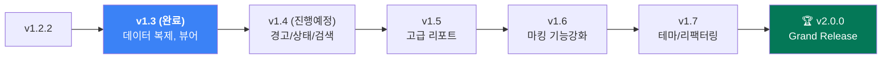

# 🧊 Plant Pocket Cold-Eye Analysis & v2.0.0 로드맵

> **평가 기준:** 프로젝트 평가자(기술 완성도)와 실 사용 현업 엔지니어(현장 실용성) 두 관점에서 냉정하게 분석합니다.
> **평가 대상:** Plant Pocket v1.3.0 (최신 배포 반영본 기준)

---

## Part 1: 냉정한 현주소 진단

### ✅ 잘된 점 (Keep)

| 항목 | 평가 |
|---|---|
| **오프라인 우선 아키텍처** | PWA + Service Worker precaching으로 비행기 모드 100% 구동. 현장 통신 음영 지역에서 핵심 가치를 발휘하는 설계가 완벽함. |
| **제로 서버 의존** | IndexedDB 로컬 저장, GitHub Pages 정적 호스팅. 서버 비용 0원, 보안 이슈 0. (v1.3.0 JSON 복제 기능으로 단일 기기 종속성 완화됨) |
| **펀치 탭 워크플로우** | 사진 촬영 → 마킹 → 저장 → 수정 → HTML 내보내기까지의 End-to-End 파이프라인. 현장 데이터 수집의 핵심 가치. |
| **번들 사이즈 우수성** | 가벼운 프론트엔드로 3G 환경에서도 즉시 로딩됨. |

### ⚠️ 문제점 (Problem)

#### 🔴 P0 — 데이터 안전성 (일부 해소)

> [!CAUTION]
> **IndexedDB는 브라우저 캐시 삭제 시 데이터가 유실됩니다.**
> v1.3.0부터 수동 JSON 백업/공유가 가능해졌으나, 자동 용량 관리나 할당량 경고 시스템은 아직 반영되지 않아 방심 시 데이터 소실의 위험은 잔존합니다.

- **원본+마킹 이중 저장 문제:** `originalImage`와 `image`의 이중 저장으로 데이터가 빠르게 부풀어오름.

#### 🟡 P1 — UX/UI 거친 부분

| 항목 | 내용 | 진행 상황 |
|---|---|---|
| **수정 취소(Cancel) 불가** | ~~수정 모드에 들어갔지만 취소할 수 있는 수단이 없음.~~ | ✅ v1.3.0 완료 |
| **세부 관찰 불가** | ~~마킹된 결함을 리스트에서 확대해서 볼 수 없음.~~ | ✅ v1.3.0 뷰어 완료 |
| **수정 모드 진입 시 혼란** | `[수정]` 버튼 누를 시 상단으로 이동만 되어 현재 상태 인지가 부족. | 미해결 |
| **리스트 성능 저하** | 30건 이상 누적 시 ``로 인한 렌더링 부하. | 미해결 |
| **마킹 펜 한계** | 단일 색상, 단일 굵기로 다중 상태 표시에 한계가 있음. | 미해결 |

#### 🟢 P2 — 코드 품질 및 확장성
- **단일 파일 비대화:** `punch.js`가 너무 비대함 (368줄+).
- **하드코딩된 스타일과 템플릿:** CSS가 `index.html` 내 인라인으로 남발되어 유지보수 어려움. 리포트 템플릿이 JS 안에 있음.

---

## Part 2: 현업 엔지니어 관점 — "있으면 좋겠다"

| 우선순위 | 변경 상태 | 요청 | 이유 |
|---|:---:|---|---|
| ⭐⭐⭐ | ⏳ | **펀치에 상태(Status) 분류 태그** | Open / In Progress / Closed 구분 |
| ⭐⭐⭐ | ⏳ | **리포트에 필터/정렬 옵션** | 특정 장비 문제만 선별하여 보고서 생성 필요 |
| ⭐⭐ | ✅ (v1.3) | ~~**전체 데이터 백업/복구**~~ | ~~폰 변경 시 JSON 내보내기를 통한 수동 이관~~ |
| ⭐⭐ | ✅ (v1.3) | ~~**사진 전체화면 보기**~~ | ~~마킹 부위 확대/비율 확인을 위한 핀치 줌 뷰어~~ |
| ⭐ | ⏳ | **다크 모드** | 야간 작업 시 눈 피로도 감소 |
| ⭐ | ⏳ | **검색** | 여러 건 중 특정 장치(Tag) 빠르게 찾기 |

---

## Part 3: v2.0.0 로드맵 (점진적 누적 릴리즈)

### ✅ v1.3.0 (완료 릴리즈) — 데이터 안전망 구축 & 오프라인 공유
> **테마: "현장 데이터는 절대 잃어버리면 안 된다"**

| 시스템 | 완료 여부 | 내용 |
|---|:---:|---|
| JSON 백업/공유 | ✅ | 기존 펀치 데이터를 `.json` 파일로 추출하여 카톡 등으로 전송 |
| JSON 복구/병합 | ✅ | 다른 사람의 `.json`을 가져올 때 ID 충돌 없이 신규 생성하여 Merge |
| Lightbox 뷰어 | ✅ (조기반영) | 리스트 사진 터치 시 전체화면 오버레이 및 핀치 줌 뷰어 제공 |
| 수정 UI 개선 | ✅ | 수정 모드에서 `[✕ 수정 취소]`하여 본래 화면으로 단번 복귀 |
| IndexedDB 경고 | ➡️ v1.4 이관 | 데이터 용량이 기기 한도에 근접할 시 경고 배너 띄우기 |

---

### v1.4.0 (Next Target) — 펀치 리스트 고도화
> **테마: "30건이 넘어도 쾌적하게"**

| 항목 | 내용 |
|---|---|
| 펀치 상태(Status) 태그 | Open / In Progress / Closed 상태 분류 뱃지 도입 |
| 장치번호 기반 검색/필터 | 리스트 상단 검색 바 추가로 실시간 필터링 |
| IndexedDB 용량 경고 배너 | 저장된 데이터가 일정 용량 초과 시 상단 경고 노출 (v1.3에서 이관) |
| 리스트 가상 스크롤(선택) | 수십 개의 고용량 이미지 Base64를 효율적으로 렌더링하기 위한 스크롤 최적화 |

---

### v1.5.0 — 리포트 내보내기 프로
> **테마: "보고서의 품격을 높인다"**

| 항목 | 내용 |
|---|---|
| 선택 내보내기 | 체크박스로 원하는/필터링된 항목만 HTML 리포트로 추출 |
| 리포트에 Status 반영 | 리포트 렌더링 시 상태 태그 색상 반영 |
| 리포트 헤더 커스텀 | 프로젝트명, 작성자 등 메타 정보를 보고서 헤더에 삽입 |
| 자동 마이그레이션 모듈 | 스토리지 버전업/구조 변경에 대비하는 IndexedDB 마이그레이션 |

---

### v1.6.0 — 마킹 도구 강력화 및 시각 개선
> **테마: "현장 그림판의 완성"**

| 항목 | 내용 |
|---|---|
| 펜 색상/굵기 선택 | 빨/파/초 등 목적별 색상 마킹 + 선 두께 2단계 조절 |
| 마킹 Undo 기능 | 전체 리셋이 아니라 "마지막 선 긋기" 한 번만 취소 |
| 텍스트 오버레이(선택) | 사진에 바로 짧은 활자(ex: Leak, C-11) 기입 |

---

### v1.7.0 — 아키텍처 리팩터링 & 범용 디자인
> **테마: "설계 부채 해소하기"**

| 항목 | 내용 |
|---|---|
| 다크 모드 | CSS Variable 기반 테마 지원 (Theme Toggle) |
| 인라인 속성 분리 | index.html 내부의 잡다한 inline-style을 style.css 전용 클래스로 분리 |
| 기능 분할(Refactoring) | `punch.js` -> 뷰어, 캔버스, 리스트, 스토리지 관리를 각각 분리 |
| 앱 아이콘 고도화 | PWA 512px, 192px 식별 가능한 정규 아이콘 등록 |

---

### 🏆 v2.0.0 — Grand Release
> **테마: "현장 엔지니어의 오프라인 스마트 워크 플랫폼"**

| 항목 | 내용 |
|---|---|
| 밸브/가스켓 규격 통합 | 플랜트 규격표를 툴킷 탭에 추가 (길이/토크 등 참조) |
| 온보딩 시스템 | 처음 진입 시 각 기능(JSON 병합, 마킹, HTML 내보내기) 사용법 팝업 가이드 |
| 성능 최적화 감사 완료 | Lighthouse 95점+ 달성 |
| 통합 패치노트 | v1.3~v1.7 요약된 최종 릴리즈 노트 |

---

## Part 4: 릴리즈 사이클 요약

---

## Part 5: 최종 한줄 평

> **"오프라인에서의 데이터 파편화 문제는 v1.3 JSON 복제로 일단락되었다. 이제 핵심은 수십 건의 상태 처리(Status)와 필터링으로 '전문 보고서 워크플로우'를 완성하는 것입니다."**
